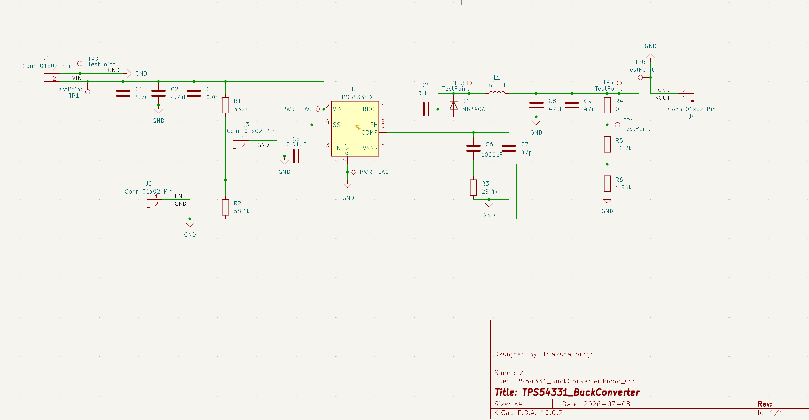
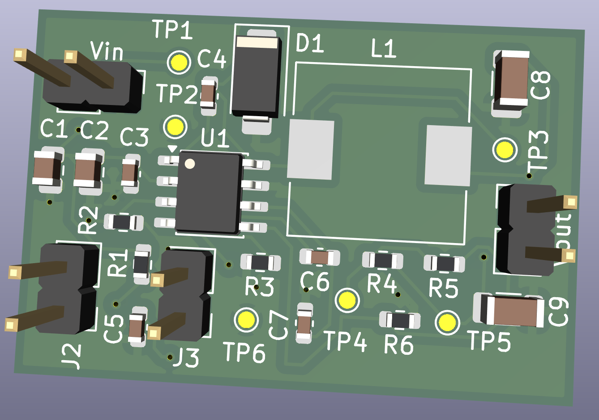
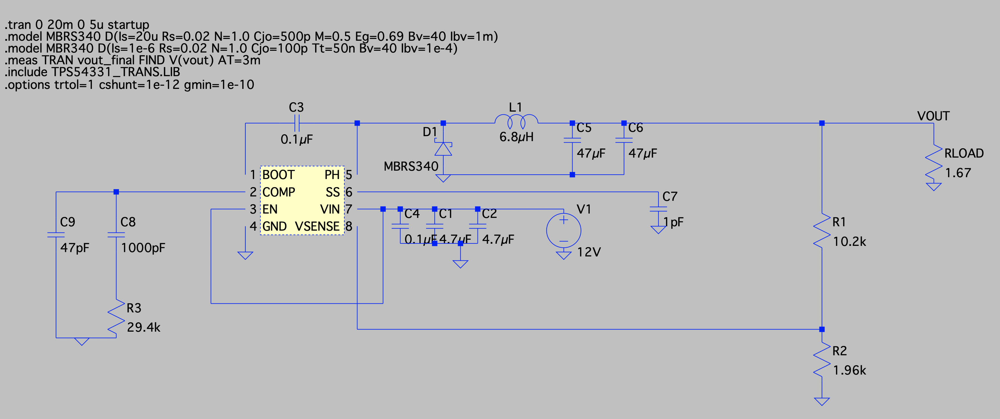
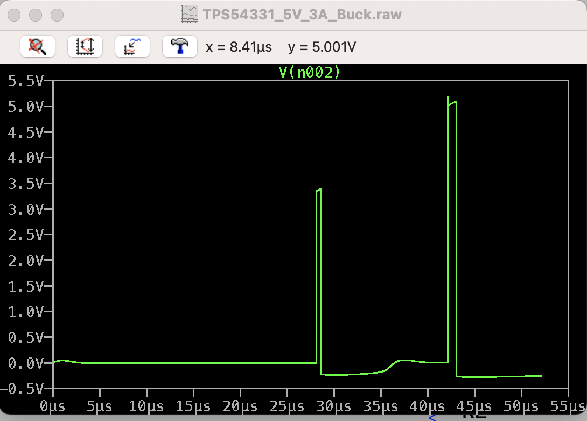
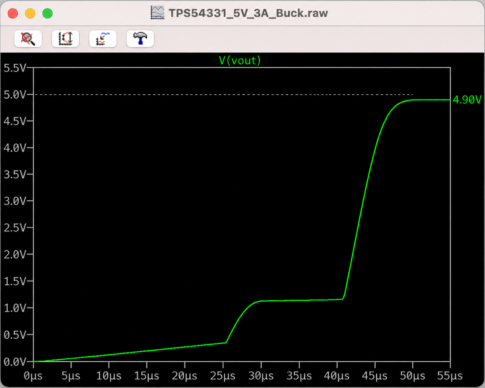

# TPS54331 Buck Converter PCB

A compact 12V to 5V, 3A step-down switching regulator, taken from datasheet spec through circuit simulation to a manufacturable PCB. Designed to power the main logic and motor-control rails of a self-balancing robot from a single input supply.

Simulated and verified in LTspice, then captured and laid out in KiCad.

**Schematic**


**PCB Layout**


## Overview

This is a custom power supply board built around the Texas Instruments TPS54331, a wide input step-down converter with an integrated high side FET rated for 3A of continuous output current. The board accepts a 12V input and produces a regulated 5V rail.

Every design decision was validated in simulation before committing to copper. The topology and component values follow the TPS54331EVM-232 reference design, with the feedback network scaled for a 5V output. The full circuit was verified in LTspice, connectivity was checked pin by pin against the generated SPICE netlist, and switching operation plus output regulation were confirmed before the schematic moved to layout.

The board layout follows switching regulator best practice: a tight switch node loop to minimize radiated noise, the catch diode and input capacitors placed close to the IC, a continuous ground return, and feedback routing kept clear of the switch node.

## Specifications

| Parameter | Value |
|-----------|-------|
| Controller IC | TI TPS54331D (SOIC-8) |
| Input Voltage | 3.5V to 28V (12V nominal) |
| Output Voltage | 5V (4.96V nominal) |
| Output Current | up to 3A |
| Switching Frequency | 570 kHz (internal) |
| Topology | Non-synchronous buck |
| Catch Diode | MB340A (3A, 40V Schottky) |
| Inductor | 6.8 uH |
| Output Capacitance | C8, C9, C10, 47 uF each |
| Feedback Reference | 0.8V internal |
| Simulation Tool | LTspice |
| PCB Tool | KiCad EDA 10.0.2 |

## How the Output Voltage Is Set

The output is programmed by a resistor divider from VOUT to the VSNS pin, referenced to the internal 0.8V reference:

```
Vout = Vref * (1 + R5 / R6),   Vref = 0.8V
     = 0.8 * (1 + 10.2k / 1.96k)
     = 4.96V
```

R5 = 10.2 kOhm, R6 = 1.96 kOhm.

## Simulation and Verification

The converter was fully simulated in LTspice before layout. This included verifying the DC operating point, confirming the switch node toggles cleanly and observing the output ramp up under soft start control toward the 5V setpoint.

**LTspice schematic**


**Switch node (PH) switching**


**Output voltage, soft start to settled regulation**


The output completes a two stage soft start ramp and settles at 4.90V, within about 1 percent of the 4.96V calculated setpoint.

The verification process surfaced and resolved several real issues in the model setup: two undefined Schottky diode models and a soft start timing problem diagnosed by probing the SS node directly. Connectivity was confirmed by tracing the generated netlist pin by pin against the model subcircuit definition. The full debugging log is in `NOTES.md`.

## Connectors

### J1, Input

| Pin | Signal | Description |
|-----|--------|-------------|
| 1 | GND | Ground |
| 2 | VIN | Input supply, 12V nominal |

### J2, Enable

| Pin | Signal | Description |
|-----|--------|-------------|
| 1 | EN | External enable control, optional |
| 2 | GND | Ground |

### J3, Track/Soft-Start

| Pin | Signal | Description |
|-----|--------|-------------|
| 1 | TR | External soft-start override, optional |
| 2 | GND | Ground |

### J4, Output

| Pin | Signal | Description |
|-----|--------|-------------|
| 1 | VOUT | Regulated 5V output |
| 2 | GND | Ground |

## Test Points

| Ref | Net | Purpose |
|-----|-----|---------|
| TP1 | VIN | Probe input voltage |
| TP2 | GND | Ground reference, input side |
| TP3 | PH | Probe switch node waveform |
| TP4 | VSNS divider node | Probe feedback voltage |
| TP5 | VOUT | Probe output voltage |
| TP6 | GND | Ground reference, output side |

## Bill of Materials

| Ref | Value | Description |
|-----|-------|--------------|
| U1 | TPS54331D | Step-down converter, SOIC-8 |
| L1 | 6.8 uH | Power inductor |
| D1 | MB340A | Catch diode, 3A 40V Schottky |
| C1, C2 | 4.7 uF | Input decoupling (MLCC) |
| C3 | 0.01 uF | Input high-frequency decoupling |
| C4 | 0.1 uF | Bootstrap capacitor, BOOT to PH |
| C5 | 0.01 uF | Soft-start capacitor |
| C6 | 1000 pF | Compensation capacitor |
| C7 | 47 pF | Compensation capacitor |
| C8, C9, C10 | 47 uF | Output capacitors |
| R1 | 332 kOhm | Enable divider, top |
| R2 | 68.1 kOhm | Enable divider, bottom |
| R3 | 29.4 kOhm | Compensation resistor |
| R4 | 0 Ohm | Output ground link |
| R5 | 10.2 kOhm | Feedback divider, top |
| R6 | 1.96 kOhm | Feedback divider, bottom |
| R7 | Not populated | Reserved footprint, no connection |
| J1 | Conn_01x02 | Input connector |
| J2 | Conn_01x02 | Enable connector |
| J3 | Conn_01x02 | Track/soft-start connector |
| J4 | Conn_01x02 | Output connector |
| TP1-TP6 | TestPoint | Probe points |

## Project Files

| File | Description |
|------|-------------|
| TPS54331_BuckConverter.kicad_sch | KiCad schematic |
| TPS54331_BuckConverter.kicad_pcb | KiCad PCB layout |
| TPS54331_BuckConverter.kicad_pro | KiCad project file |
| sim/TPS54331_5V_3A_Buck.asc | LTspice schematic |
| sim/TPS54331_TRANS.asy | LTspice symbol for the TPS54331 |
| sim/TPS54331_TRANS.LIB | TI transient model |
| NOTES.md | Design derivation and debugging log |

## Running the Simulation

1. Open `sim/TPS54331_5V_3A_Buck.asc` in LTspice.
2. Keep `TPS54331_TRANS.asy` and `TPS54331_TRANS.LIB` in the same folder as the schematic so the symbol and model resolve.
3. Run the transient analysis.

The schematic defines models for both Schottky diodes (`MB340A` for the external catch diode and `MBR340` for a diode referenced internally by the TI model). Both are required for the simulation to run.

## Tools Used

- KiCad EDA 10.0.2, schematic capture and PCB layout
- LTspice, circuit simulation and verification
- Texas Instruments TPS54331 Datasheet (SLVS827)
- TPS54331EVM-232 User Guide, reference schematic

## Status

- Simulation verified, switching and regulation confirmed
- Schematic complete
- Layout complete
- 3D render generated
- DRC complete, 0 errors, 0 violations

## What I Learned

- The complete switching regulator design flow, from datasheet specification to verified simulation to board layout
- Reading and debugging behavioral SPICE models, including resolving undefined component models and diagnosing a soft start timing issue by probing internal nodes
- Verifying schematic connectivity pin by pin against a generated SPICE netlist rather than trusting the visual schematic alone
- Switch node loop minimization and input decoupling placement for low noise switching converters
- Feedback and compensation network design around an internal voltage reference
- Building a custom KiCad symbol from a datasheet pinout when no library part exists

## Author

Triaksha Singh
Designed July 2026
